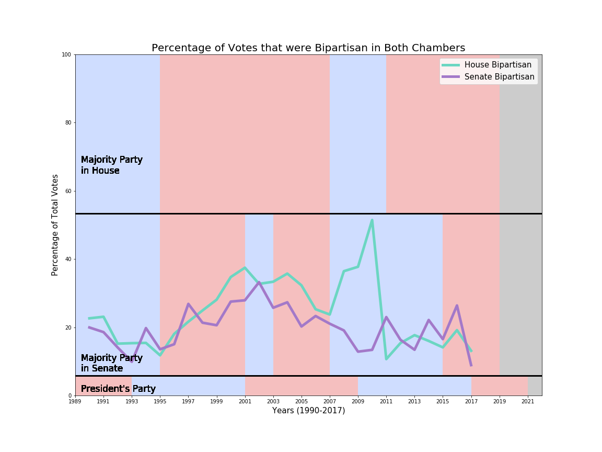

# Partisan
An analysis of the partisan behavior for the U.S. House of Representatives and U.S. Senate
## Outline
Started with data from each individual vote that took place in the House of Representatives or the Senate, and then summarize data into the CSV files with the use of a scraper. 
Scraper is available in the Data Crawler folder. 
Used Matplotlib to draw preliminary line graphs. 

## Sample graphs
Below is a graph Partisan Voting in Both Houses of Congress. Generated by a call to the datasci() method

Next is Nonpartisan

Next is Bipartisan

Next up is a graph displaying Partisan, Bipartisan, and Non Partisan voting in the U.S. House of Representatives. 

Next up is a graph displaying Partisan, Bipartisan, and Non Partisan voting in the U.S Senate. 

##Disclaimers
The following data and graphical representations were created by Shivam Parikh in the span of January 26th, 2017 to April 2nd 2017. 
The data used to generate these graphs and analysis were gethered from the government websites themselves, listed here: 
1) http://clerk.house.gov/
2) https://www.senate.gov/pagelayout/legislative/a_three_sections_with_teasers/votes.htm
The most recent data for the 2017 congress was pulled on April 2nd at 11:13 AM. 
The analysis and graphs are property of Shivam Parikh, Copyright 2017. Do not reproduce or publish without visible credit to, or explicit written permission from, the creator. 
